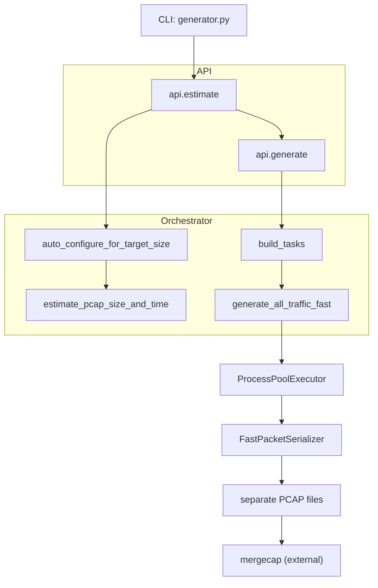

# Architecture overview

This document highlights the main runtime components and why the generator is split into estimation, tasking, serialization, and manual merging.

## Goals
- Keep generation fast by emitting each traffic stream into its own PCAP.
- Make the workflow reproducible (Config + deterministic seeds) while retaining manual merge control (mergecap).
- Surface per-protocol traffic counts so you can tune traffic composition before merging.

## Project layout

```
src/net_traffic_sim/
├── api.py             # public estimate/generate helpers
├── cli.py             # entrypoint wiring for the console script
├── generator.py       # CLI argument parsing + orchestration
├── config.py          # scenario constants (hosts, rates, file transfers)
├── helpers.py         # shared utilities (headers, GUIDs, exposures)
├── logging_setup.py   # structured logging helpers
├── random_pool.py     # deterministic randomness source
├── tcp.py             # TCP option helpers (timestamps, retransmits)
├── orchestrator/      # auto-configure/estimate → task builder → process pool runner
│   ├── __init__.py
│   ├── estimate.py     # auto-configure multipliers + size/time projection
│   ├── runner.py       # multiprocessing entrypoint (ProcessPoolExecutor)
│   └── tasks.py        # per-protocol task builders + serializer wiring
├── protocols/         # per-protocol traffic generators + registry
│   ├── __init__.py
│   ├── auth.py
│   ├── dns.py
│   ├── http.py
│   ├── https.py
│   ├── icmp.py
│   ├── misc.py
│   ├── rdp.py
│   ├── scanners.py
│   ├── smb.py
│   ├── sql.py
│   └── sharepoint.py  # SharePoint/portal traffic + scanners & helpers
├── serializer.py      # buffered PCAP writer (FastPacketSerializer)
├── state.py           # GeneratorContext + shared runtime state
└── scapy_setup.py     # Scapy tuning helpers
```

## Shared state
- `config.py` houses all constants (`Config.from_defaults()`, rate multipliers, `FILE_TRANSFERS`, `SHAREPOINT_SERVER_IP`, etc.).
- `state.py` exposes `TrafficGenerator`/`GeneratorContext`; it builds the MAC/port tables and RNG seeds shared by every protocol worker.
- `serializer.py` provides `FastPacketSerializer`, which batches writes and normalizes TCP options before flushing to disk.

## Orchestrator flow
1. The CLI (`src/generator.py`) parses arguments, configures logging/Scapy, and invokes `api.estimate` to align the scenario with the requested target size and duration.
2. `api.estimate` delegates to `orchestrator.auto_configure_for_target_size` to tune rate constants, then calls `estimate_pcap_size_and_time` to project packet counts and wall-clock time.
3. When generation starts, `api.generate` uses `generate_all_traffic_fast` to build per-protocol `Task` objects via `orchestrator.tasks.build_tasks` and hand them to a `ProcessPoolExecutor`.
4. Each worker process initializes its `GeneratorContext` (seeded from `Config.seed`) before running a task, so parallel generators remain deterministic when a seed is set.

## Why protocol-separated output
- Each `Task` (DNS, SMB, HTTP, etc.) writes directly to its own PCAP to avoid runtime locking/sorting across generators.
- Separating the streams keeps files small, makes per-protocol review easier, and lets you control merge flags (`mergecap`) for the final timeline.
- The CLI logs each task's packet and byte counts so you can assess coverage before merging.

## Serializer and buffered writers
- `serializer.FastPacketSerializer` wraps `scapy.utils.RawPcapWriter` and batches up to 1,000 packets per flush to reduce syscall overhead.
- TCP options are normalized (timestamp wrapping, numeric bounds) before writes, and errors are tracked by type so you can inspect warnings after the run.
- Each task closes its serializer at completion, which flushes remaining packets and logs packet counts.

## Multiprocessing strategy
- `generate_all_traffic_fast` uses `ProcessPoolExecutor`, so CPU-bound protocol generators run in parallel on separate processes.
- Workers call `_init_worker_context` to share configuration state and a deterministic `GeneratorContext` seed per run.
- Tasks are built once per invocation and submitted immediately, so slow protocols do not stall others (you still get summary stats for failures).
- This approach trades slightly higher startup cost for linear scaling on multi-core machines and avoids writing to one giant PCAP in Python.

## Data flow diagram
