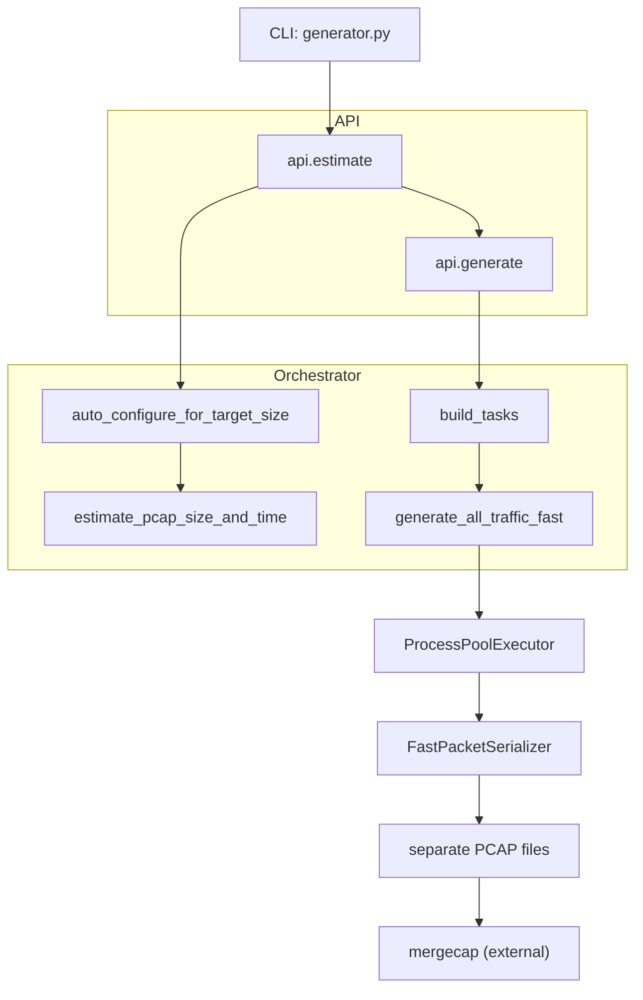

# Architecture Documentation

**Last Updated**: 2024-12-29
**Version**: 0.1.0
**Status**: Current

## Overview

This document explains the internal architecture of net-traffic-sim. Read this if you're:
- Contributing new protocols or features
- Debugging performance issues
- Understanding the multiprocessing implementation
- Exploring the codebase structure

For usage instructions, see [README.md](README.md).

## Data Flow

The following diagram illustrates how traffic generation flows from CLI input through orchestration to final PCAP output:



**Explanation:**
1. **CLI** parses user arguments (target size, duration, flags)
2. **Estimator** auto-tunes traffic rates to meet target requirements
3. **Generator** creates protocol tasks and distributes to worker pool
4. **Scheduler** runs tasks in parallel across CPU cores
5. **Serializer** buffers and writes individual protocol PCAPs
6. **Merge** combines all PCAPs into final timeline-sorted output

## Design Goals

- **Fast generation**: Emit each traffic stream into its own PCAP for parallel processing
- **Reproducibility**: Configuration + deterministic seeds enable repeatable generation
- **Manual merge control**: Users control final merge via `mergecap` for flexibility
- **Transparency**: Expose per-protocol traffic counts for tuning before merging

## Project Layout

```
src/net_traffic_sim/
├── api.py             # Public estimate/generate API
├── cli.py             # Console script entrypoint
├── generator.py       # CLI argument parsing and orchestration
├── config.py          # Scenario configuration (hosts, rates, transfers)
├── helpers.py         # Shared utilities (headers, GUIDs, timestamps)
├── logging_setup.py   # Structured logging configuration
├── random_pool.py     # Deterministic randomness source
├── tcp.py             # TCP option helpers (timestamps, retransmits)
├── orchestrator/      # Auto-configuration and parallel execution
│   ├── __init__.py
│   ├── estimate.py     # Auto-configure multipliers and size projection
│   ├── runner.py       # Multiprocessing coordination (ProcessPoolExecutor)
│   └── tasks.py        # Per-protocol task builders and serializer wiring
├── protocols/         # Protocol-specific traffic generators
│   ├── __init__.py     # Protocol registry
│   ├── base.py         # BaseProtocol abstract class
│   ├── auth.py         # Kerberos/LDAP authentication
│   ├── dns.py          # DNS queries (UDP and TCP)
│   ├── http.py         # HTTP traffic patterns
│   ├── https.py        # HTTPS/TLS encrypted traffic
│   ├── icmp.py         # ICMP ping/traceroute
│   ├── ntp.py          # NTP time synchronization
│   ├── radius.py       # RADIUS enterprise authentication
│   ├── rdp.py          # Remote Desktop Protocol
│   ├── scanners.py     # Port scanning and reconnaissance
│   ├── smb.py          # SMB file sharing
│   ├── sql.py          # SQL/TDS database traffic
│   └── [35 total protocol files]
├── serializer.py      # Buffered PCAP writer (FastPacketSerializer)
├── state.py           # GeneratorContext and shared runtime state
└── scapy_setup.py     # Scapy performance tuning
```

## Shared State

### Configuration (`config.py`)
- Houses all constants via `Config.from_defaults()`
- Defines rate multipliers (business hours vs off-hours)
- Contains traffic catalogs (`FILE_TRANSFERS`, server IPs, domain lists)
- Supports YAML and JSON configuration file formats

### Generator State (`state.py`)
- Exposes `TrafficGenerator` and `GeneratorContext` classes
- Builds MAC address tables and port mappings
- Manages RNG seeds shared across protocol workers
- Ensures deterministic generation when seed is specified

### Serializer (`serializer.py`)
- Provides `FastPacketSerializer` for buffered PCAP writes
- Batches up to 1,000 packets per flush to reduce syscall overhead
- Normalizes TCP options (timestamp wrapping, sequence numbers)
- Tracks errors by type for post-run inspection

## Orchestrator Flow

The orchestrator coordinates estimation, task creation, and parallel execution:

### 1. Estimation Phase
**Entry**: CLI (`src/generator.py`) parses arguments and invokes `api.estimate`

**Process**:
- `orchestrator.auto_configure_for_target_size` tunes rate constants
- `estimate_pcap_size_and_time` projects packet counts and wall-clock time
- Returns estimated runtime and PCAP size before generation starts

### 2. Task Building Phase
**Entry**: `api.generate` initiates traffic generation

**Process**:
- `orchestrator.tasks.build_tasks` creates per-protocol `Task` objects
- Each task includes protocol name, configuration, and output path
- Tasks are submitted to `ProcessPoolExecutor` for parallel execution

### 3. Execution Phase
**Process**:
- Each worker process initializes `GeneratorContext` with seeded RNG
- Protocol generators run independently in separate processes
- `FastPacketSerializer` writes buffered packets to individual PCAPs
- Workers report packet/byte counts upon completion

### 4. Completion Phase
**Process**:
- All tasks flush remaining packets and close serializers
- CLI logs summary statistics (packets, bytes per protocol)
- User manually merges PCAPs with `mergecap` for final output

## Protocol-Separated Output

### Why Separate PCAPs?

**Performance**:
- Each protocol writes to its own file, avoiding cross-generator locking
- No runtime sorting overhead during generation
- Parallel writes maximize disk I/O throughput

**Flexibility**:
- Per-protocol review and analysis before merging
- Users control merge order and filtering via `mergecap` flags
- Small files are easier to work with than monolithic captures

**Transparency**:
- CLI logs individual protocol packet/byte counts
- Assess coverage and traffic composition before final merge
- Identify and debug protocol-specific issues

### Merge Process

Users combine protocol PCAPs using Wireshark's `mergecap`:

```bash
mergecap -w final_output.pcap temp_pcaps/*.pcap
```

This produces a single PCAP with all traffic sorted by timestamp, suitable for analysis in Wireshark or other tools.

## Multiprocessing Strategy

### Architecture

**ProcessPoolExecutor**:
- `generate_all_traffic_fast` uses Python's `ProcessPoolExecutor`
- CPU-bound protocol generators run in parallel on separate processes
- Scales linearly up to available CPU core count

**Worker Initialization**:
- Workers call `_init_worker_context` to share configuration state
- Each worker receives a deterministic `GeneratorContext` seed
- Ensures reproducible generation across runs when seed is set

**Task Distribution**:
- Tasks are built once per invocation and submitted immediately
- Slow protocols don't stall others (independent execution)
- Summary statistics provided for both successes and failures

### Trade-offs

**Advantages**:
- Linear scaling on multi-core machines (~3-4x speedup on 8-12 cores)
- Avoids GIL limitations of Python threading
- Prevents single-file contention bottlenecks

**Costs**:
- Slightly higher startup overhead (process forking)
- Temporary disk space for multiple PCAPs (~2x final size)
- Manual merge step required after generation

## Performance Characteristics

### Multiprocessing Efficiency

**Scaling Behavior**:
- **Single worker**: Baseline generation speed
- **Auto workers** (CPU core count): ~3-4x faster than single worker
- **Custom workers**: Scales linearly up to core count, then plateaus

**Test Suite Performance (189 tests)**:
- Sequential: ~150s
- 2 workers: ~77s (1.9x speedup)
- 4 workers: ~52s (2.9x speedup)
- Auto/12 workers: ~42s (3.6x speedup)

### Resource Usage

**Memory**:
- Base process: ~100-200 MB
- Per worker: ~50-200 MB (protocol dependent)
- Total: ~500 MB - 4 GB depending on worker count and traffic density

**Disk I/O**:
- Temporary PCAPs stored in `temp_pcaps/` (configurable)
- Write pattern: Sequential buffered writes (1000-packet batches)
- Temporary space: ~2x target PCAP size during generation
- Final space: 1x target PCAP size after merge

**CPU**:
- High utilization during packet generation phase
- Low utilization during merge (I/O bound)
- Ideal: 8+ cores for maximum throughput

### Factors Affecting Performance

**Hardware**:
- CPU core count (more cores = faster)
- Disk I/O speed (SSD strongly recommended over HDD)
- Available RAM (limits parallel worker count)

**Configuration**:
- Checksum generation (`--checksums` adds ~30% overhead)
- Protocol mix (complex protocols like SMB are slower)
- Traffic density (higher packet rates increase CPU load)

See [README.md Performance & Scalability section](README.md#performance--scalability) for detailed benchmarks.

## Error Handling

### Generation Failures

**Protocol-Level Failures**:
- If a single protocol generator fails, error is logged but doesn't stop others
- Partial results are preserved (successful protocols still generate PCAPs)
- Exit code reflects whether any failures occurred

**Example**:
```
ERROR: RADIUS protocol failed: Connection timeout
WARNING: Continuing with remaining protocols...
```

### Resource Exhaustion

**Out of Disk Space**:
- Generation stops immediately when write fails
- Partial PCAP files remain in temp directory for inspection
- User must free space and re-run generation

**Out of Memory**:
- Worker processes may crash under extreme memory pressure
- System attempts to continue with remaining workers
- Reduce worker count or traffic density if OOM occurs

**Stuck Workers**:
- No current timeout mechanism (future enhancement planned)
- Workers may hang indefinitely on certain edge cases
- Manual process termination required (Ctrl+C)

### Recovery Mechanisms

**On Success**:
- Temporary files cleaned up after successful merge (if `--keep-temps` not set)
- Final PCAP ready for analysis

**On Failure**:
- Temporary files remain in output directory for debugging
- Located in system temp directory or specified `--output-dir`
- Check logs for specific error messages and stack traces

## Serializer and Buffered Writes

### FastPacketSerializer

**Buffering Strategy**:
- Batches up to 1,000 packets before flushing to disk
- Reduces syscall overhead by ~10-20x compared to per-packet writes
- Automatically flushes on buffer full or serializer close

**TCP Normalization**:
- Timestamp wrapping (handles 32-bit overflow)
- Sequence number bounds checking
- Option field validation

**Error Tracking**:
- Errors tracked by type (invalid checksum, malformed packet, etc.)
- Summary logged after task completion
- Warnings don't halt generation (best-effort)

### Implementation

```python
class FastPacketSerializer:
    def __init__(self, output_path: str, buffer_size: int = 1000):
        self.writer = RawPcapWriter(output_path)
        self.buffer = []
        self.buffer_size = buffer_size

    def write(self, packet: Packet) -> None:
        self.buffer.append(packet)
        if len(self.buffer) >= self.buffer_size:
            self.flush()

    def flush(self) -> None:
        for packet in self.buffer:
            self.writer.write(packet)
        self.buffer.clear()
```

## Contributing

For information on adding new protocols, testing requirements, and code style guidelines, see [CONTRIBUTING.md](CONTRIBUTING.md).

## Documentation

- **[README.md](README.md)** - Usage instructions, installation, examples
- **[CONTRIBUTING.md](CONTRIBUTING.md)** - Development guidelines and workflow
- **[CHANGELOG.md](CHANGELOG.md)** - Version history and notable changes
